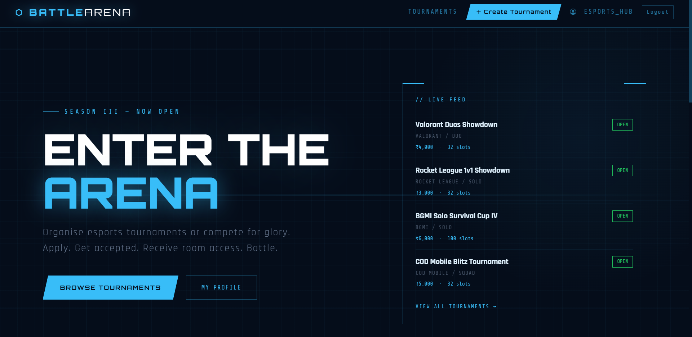
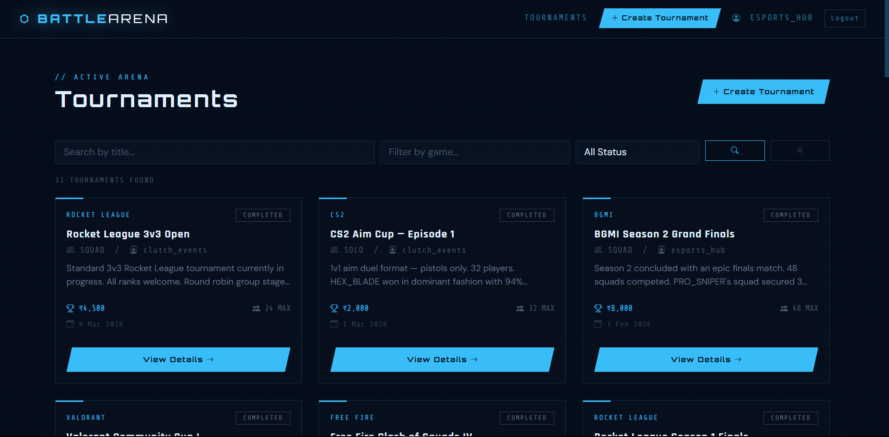
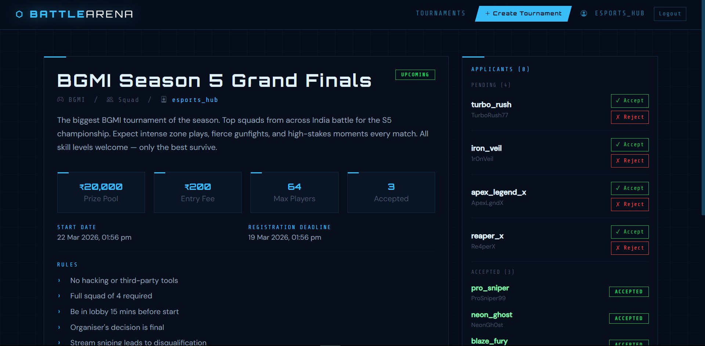
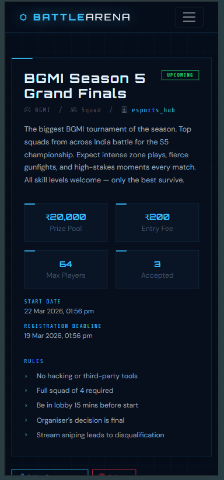

# ⬡ BattleArena — Compete. Dominate. Win.

> A full-stack esports tournament management platform where organisers host tournaments and players apply, get accepted, and receive room credentials to battle.  
> Features a Cyber Grid dark theme, role-based auth, admin panel, and real-time status updates.

<br>

## 🌐 Live Demo

**[https://battlearena-ypvr.onrender.com](https://battlearena-ypvr.onrender.com)**

> ⚠️ Hosted on Render free tier — may take 30–50 seconds to wake up on first visit.

<br>

## 📸 Screenshots

| Landing | Tournaments | Tournament Detail |
|---|---|---|
|  |  |  |

| Mobile View |
|---|
|  |

<br>

## ✨ Features

### 🎮 Players
- Browse and search tournaments by game, status, or title
- Apply to join tournaments with one click
- Withdraw pending applications
- View room ID and password after acceptance
- Track full tournament history on profile

### 🏆 Organisers
- Create tournaments with full details — rules, prize pool, entry fee, mode, dates
- Accept or reject player applications individually
- Update room credentials anytime after accepting players
- Edit or delete their tournaments

### 🛡️ Admin Panel
- Ban / unban users with reason — banned users see a dedicated blocked page
- Block / unblock tournaments from public view with reason
- Change user roles (player ↔ organiser)
- Dashboard with live platform stats

### ⚙️ Platform
- Tournament status auto-updates based on dates (upcoming → ongoing → completed)
- Tournaments sorted by status — live first, upcoming next, completed last
- Cyber Grid dark theme — Orbitron, Share Tech Mono, Rajdhani typography
- Fully responsive — mobile friendly
- Flash notifications with auto-dismiss
- Client-side form validation on all forms (no browser defaults)
- Sessions stored in MongoDB Atlas via connect-mongo

<br>

## 🛠️ Tech Stack

| Layer | Technology |
|---|---|
| **Runtime** | Node.js |
| **Framework** | Express.js |
| **Database** | MongoDB Atlas + Mongoose |
| **Auth** | Passport.js + passport-local-mongoose |
| **Sessions** | express-session + connect-mongo |
| **Templating** | EJS |
| **Frontend** | Bootstrap 5 + Custom CSS + Vanilla JS |
| **Deployment** | Render + MongoDB Atlas |

<br>

## 📁 Project Structure

```
BattleArena/
├── models/
│   ├── user.js               # User schema — player, organiser, admin roles
│   └── tournament.js         # Tournament schema with applicants subdoc
├── routes/
│   ├── auth.js               # Register, login, logout, banned page
│   ├── tournament.js         # Tournament CRUD + room details update
│   ├── application.js        # Apply, accept, reject, withdraw
│   ├── profile.js            # View and edit profile
│   └── admin.js              # Admin dashboard, user & tournament management
├── views/
│   ├── partials/             # navbar, flash, head, scripts, tournament-card
│   ├── auth/                 # login, register, banned
│   ├── tournaments/          # index, show, new, edit
│   ├── profile/              # show, edit
│   ├── admin/                # dashboard, users, tournaments
│   └── errors/               # 404, error
├── public/
│   ├── css/
│   │   ├── style.css         # Global cyber grid theme
│   │   ├── landing.css       # Hero, stats bar, steps, roles, footer
│   │   └── errors.css        # 404 glitch animation, error page
│   └── js/
│       ├── main.js           # Flash auto-dismiss (global)
│       ├── tournament-form.js # Rules system + validation
│       ├── landing.js        # Count-up animation
│       └── auth-form.js      # Login/register validation
├── middleware.js              # isLoggedIn, isOrganiser, isAdmin, autoUpdateStatus
├── app.js                    # Express app entry point
├── init.js                   # Database seeder
└── .env.example
```

<br>

## ⚙️ Local Setup

### Prerequisites
- Node.js v18+
- MongoDB running locally

### 1. Clone the repo
```bash
git clone https://github.com/ryan-4u/BattleArena.git
cd BattleArena
```

### 2. Install dependencies
```bash
npm install
```

### 3. Create `.env` in project root
```env
PORT=3000
MONGO_URL=mongodb://127.0.0.1:27017/battlearena
SESSION_SECRET=your_secret_key
NODE_ENV=development
```

### 4. Seed sample data
```bash
node init.js
```

### 5. Run locally
```bash
npm run dev
```

App runs at **http://localhost:3000**

<br>

## 🗺️ API Routes

| Method | Route | Auth | Description |
|---|---|---|---|
| GET | `/` | — | Landing page |
| GET | `/tournaments` | — | All tournaments with search & filter |
| GET | `/tournaments/new` | ✅ Organiser | New tournament form |
| POST | `/tournaments` | ✅ Organiser | Create tournament |
| GET | `/tournaments/:id` | — | Tournament detail |
| GET | `/tournaments/:id/edit` | ✅ Owner | Edit form |
| PUT | `/tournaments/:id` | ✅ Owner | Update tournament |
| DELETE | `/tournaments/:id` | ✅ Owner | Delete tournament |
| PATCH | `/tournaments/:id/room` | ✅ Owner | Update room credentials |
| POST | `/tournaments/:id/apply` | ✅ Player | Apply to tournament |
| DELETE | `/tournaments/:id/withdraw` | ✅ Player | Withdraw application |
| PATCH | `/tournaments/:id/applicants/:uid/accept` | ✅ Owner | Accept player |
| PATCH | `/tournaments/:id/applicants/:uid/reject` | ✅ Owner | Reject player |
| GET | `/admin` | ✅ Admin | Admin dashboard |
| GET | `/admin/users` | ✅ Admin | Manage users |
| GET | `/admin/tournaments` | ✅ Admin | Manage tournaments |
| PATCH | `/admin/users/:id/ban` | ✅ Admin | Ban user |
| PATCH | `/admin/users/:id/unban` | ✅ Admin | Unban user |
| GET | `/register` | — | Register page |
| POST | `/register` | — | Create account |
| GET | `/login` | — | Login page |
| POST | `/login` | — | Authenticate |
| GET | `/logout` | ✅ | Logout |

<br>

## 🧪 Seed Credentials

After running `node init.js`:

| Role | Username | Password |
|---|---|---|
| Admin | `arena_admin` | `admin123` |
| Organiser | `esports_hub` | `org123` |
| Organiser | `pro_league` | `org123` |
| Organiser | `clutch_events` | `org123` |
| Player | `pro_sniper` | `player123` |
| Player | `shadow_ace` | `player123` |
| Player | `zero_recoil` | `player123` |
| Player | *(21 more players)* | `player123` |

**Games covered:** BGMI · Valorant · Free Fire · CS2 · COD Mobile · Rocket League

**Tournaments:** 10 upcoming · 10 ongoing · 12 completed

<br>

## 🔒 Environment Variables

| Variable | Description |
|---|---|
| `PORT` | Server port (default: 3000) |
| `MONGO_URL` | MongoDB connection string |
| `SESSION_SECRET` | Session encryption secret |
| `NODE_ENV` | Set to `production` on deploy |

<br>

## 👨‍💻 Author

**Aaryan Aggrawa**
- 🐙 GitHub: [@ryan-4u](https://github.com/ryan-4u)
- 📧 Email: aaryanaggrawa.dev@gmail.com
- 🌐 Portfolio: [aaryan-aggrawa-v1.netlify.app](https://aaryan-aggrawa-v1.netlify.app)

<br>

## 📄 License

This project is open source under the [MIT License](LICENSE).

---

> Built as a portfolio project demonstrating full-stack development — Node.js, Express, MongoDB, Passport.js auth, role-based access control, admin panel, EJS templating, and responsive UI/UX design.
